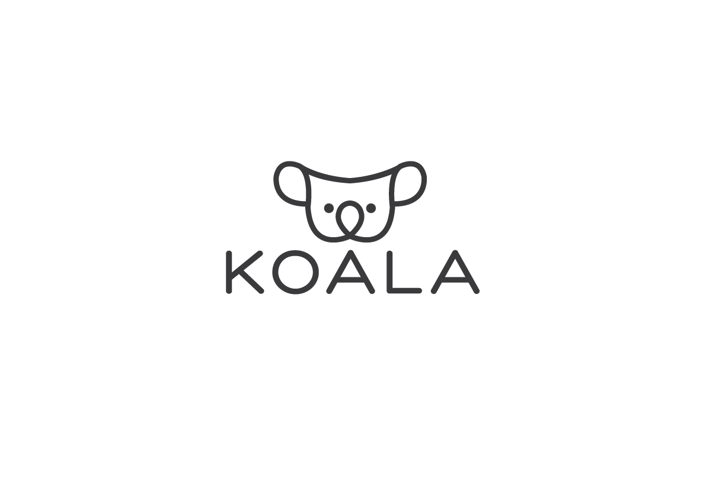

# koala

the complete restful koajs app, use for onions event API request server



# Getting started

Install below npm packages:

```bash
$ npm install -g pm2 eslint babel-eslint eslint-config-airbnb eslint-plugin-filenames
 js-beautify
```

Running in development via `npm run dev`.
